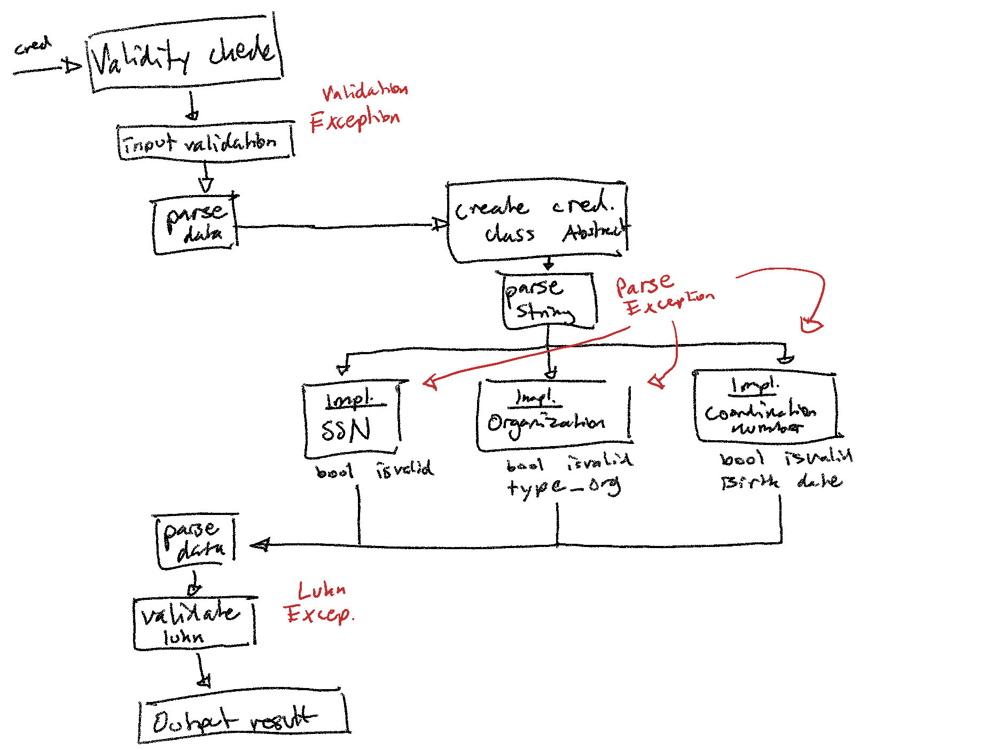

## Filstruktur
```bash
.
├── README.md
├── run_scanner.sh                         # bash script för kompilering och exekvering av huvudprogram
├── run_testvalues.sh                      # bash script för kompilering och exekvering av testvärden
└── src
    ├── main
    │   ├── Exceptions                     # Diverse exceptions
    │   │   ├── LuhnException.java
    │   │   ├── ParsingException.java
    │   │   └── ValidationException.java 
    │   ├── Helper
    │   │   ├── OrganizationMapper.java    # Hjälper mappa typ av juridisk organisation
    │   │   ├── Credential.java            # Abstrakta klassen för alla "nummer"
    │   │   └── CredentialFactory.java     # Sköter byggning av rätt "nummer"-implementation
    │   ├── CoordinationNumber.java        # Samordningsnummer
    │   ├── OrganizationNumber.java        # Organisationsnummer
    │   ├── SocialSecurityNumber.java      # Personnummer
    │   └── ValidityCheck.java             # huvudklass (main, valideringscheck av luhn, mm)
    └── test                               # huvudklass (main, valideringscheck av luhn, mm)
        └── ValidityCheckTest.java         # Kör Omegapoints testvärden
```

## Exekvering (från CLI)
> Ska även funka fint genom Intellij :)

Det finns två startscript. Den ena (`run_scanner.sh`) tar input från CLI, det andra (`run_testvalues.sh`) kör programmet på testvärdena från problem-PM:et.
Kör valda startscriptet från root dir genom:
```bash
sh run_scanner.sh
# eller
sh run_testvalues.sh
```

### Exempel log
```bash
$ sh run_testvalues
VALID       Credential ID         : 201701102384
 PER        Birth Number          : 238
            Checksum              : 4
            Birth Date (YYYYMMDD) : 20170110
            Age                   : 8
-------------------------------------------------
.
.
.
INVALID     Credential ID         : 201701272394

LuhnException: Checksum is not valid: yymmdd=170127, calculated checksum=3
-------------------------------------------------
.
.
.
VALID       Credential ID         : 190910799824
 SAM        Birth Number          : 982
            Checksum              : 4
            Birth Date (YYYYMMDD) : 19091019
            Age                   : 115
-------------------------------------------------
VALID       Credential ID         : 556614-3185
 ORG        Birth Number          : 318
            Checksum              : 5
            Birth Date (YYYYMMDD) : 556614
            Organization Type     : AKTIEBOLAG
-------------------------------------------------
```

## Möjliga problem
- Validering
  - Validering av organisationsnummer görs bara genom att titta på mittersta sifferparet.
    - Ett felinskrivet personummer med månad > 12 skulle alltså bli ett organisationsnummer.
      - Men hur validera organisationsnummer vidare?
  - Samma gäller för samordningsnummer (första siffran i dag > 3)
  - Luhn täcker delvis

## Egna notes från utveckling/problemuppställning
> Ursäkta handstilen :)
> Kartan gjordes i början av utvecklingen och fungerade som ett flödesdiagram (väldigt överskådlig bild utan specifika detaljer)


```
ValidityCheck
- logga kontroller som görs
- input är string

Personnummer:
- 6 siffror
  - ÅÅMMDD
- 3 siffror födelsenummer
- 1 kontrollsiffra (luhns algoritm)
- ålder > 100 år
  - + mellan ÅÅDDMM och födelsenummer
  eller
  - århundrade (18, 19, 20) före födelsedatum

ex. 10-siffrigt PN utan avdelar = person yngre än 100

Samordningsnummer:
- samma regler som PN, men 60 läggs till datumet
  - dag + 60 = [61, 91]

Organisationsnummer:
- första siffran är vilken juridisk form organisationen har
- mittersta siffran måste vara minst 20
- sista siffran är kontrollsiffra
  - samma som för PN
- kan inledas med "århundrade" 16 om det anges på 12-siffrig form


LÄNGD
- PER: [10, 13]
- SAM: [10, 13]
- ORG: [11, 13]
```